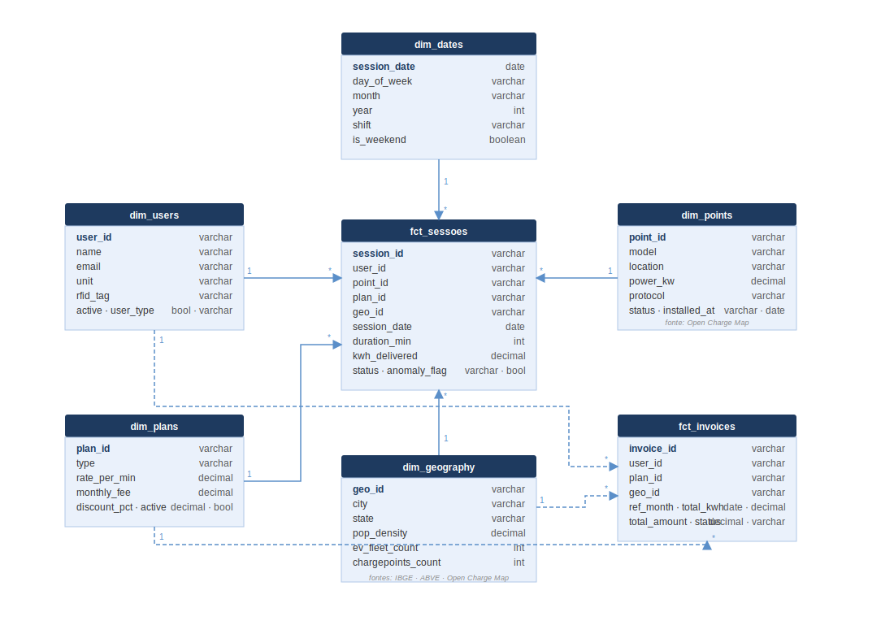

# EV ChargeOps — Sprint 01

**Enterprise Challenge 2026 · GoodWe × FIAP · Equipe 35**

| Nome | RM |
|------|----|
| Arthur Apolonio de Oliveira | rm571385 |
| Matheus Bejarano da Costa Resende | rm569195 |
| Dayvid Daniel Duarte Ramos | rm569482 |
| Bryan Lima Garcia | rm573611 |
| Vinicius Valiati Costa | rm568674 |

---

## O Problema

O crescimento da frota de veículos elétricos no Brasil é acelerado e consistente. Em maio de 2026, os eletrificados já representavam 17% das vendas de automóveis leves ante 7,8% no mesmo período de 2025. Esse crescimento chega inevitavelmente nos condomínios residenciais e edifícios corporativos, que passam a receber múltiplas solicitações de instalação de carregadores em vagas privativas e áreas comuns.

O problema é operacional: infraestruturas de recarga compartilhadas não têm mecanismos para estruturar sessões por usuário, calcular consumo individual e aplicar regras de cobrança justas. Sem gestão, o custo vai para a conta coletiva e é dividido entre todos inclusive quem não tem veículo elétrico. Com instalações desordenadas, o risco de sobrecarga elétrica aumenta e o acesso para novos moradores fica comprometido.

O EV ChargeOps transforma cada sessão de recarga em dados estruturados que alimentam um sistema de cobrança automatizado, transparente e escalável. O piloto é o carregador GoodWe HCA G2 instalado no campus da FIAP a base para validar a solução antes de levá-la a condomínios e prédios corporativos.

---

## Frente 1 — Contexto e Problema

### Crescimento da frota no Brasil

A frota acumulada de veículos elétricos no Brasil ultrapassou 705 mil unidades em março de 2026. Em todo o ano de 2025, foram 223.912 emplacamentos recorde histórico. O ritmo em 2026 aponta para superar esse número: só no primeiro trimestre, 83.947 unidades foram emplacadas.

| Ano | Emplacamentos | Destaque |
|-----|--------------|----------|
| 2023 | 94.347 | Primeiro ano acima de 90 mil |
| 2024 | 148.621 | Crescimento de 57% sobre 2023 |
| 2025 | 223.912 | Recorde histórico |
| Jan–Mar 2026 | 83.947 | Ritmo de ~28 mil/mês |

A concentração geográfica é relevante para o modelo de expansão da plataforma. São Paulo lidera com 181.305 unidades, seguido por Distrito Federal (48.502) e Rio de Janeiro (39.295). O Sudeste concentra 44,2% de todas as vendas onde a demanda por infraestrutura compartilhada é mais urgente.

Em setembro de 2025, o Brasil contava com 16.880 eletropostos públicos e semipúblicos. A proporção é de aproximadamente um eletroposto para cada 40 veículos elétricos, o que confirma que a maior parte das recargas acontece em ambientes privados condomínios, estacionamentos corporativos e residências. Esse é o mercado que o EV ChargeOps endereça.

### Desafios em infraestruturas compartilhadas

Os principais problemas identificados em condomínios e prédios corporativos:

- Sem medição individual, o custo da energia vai para a conta coletiva e é dividido entre todos os moradores, independente do uso
- Instalações feitas sem coordenação central criam risco de sobrecarga elétrica e desigualdade de acesso
- Sem controle de sessões, não há histórico de uso por usuário nem base para cobrança
- Usuários não têm visibilidade do próprio consumo nem projeção de custo mensal

### Como funciona uma sessão de recarga

1. O usuário conecta o cabo e se autentica via cartão RFID ou app
2. O carregador confirma a identidade e registra o início da sessão
3. A energia é transferida ao veículo; o medidor individual registra o consumo a cada 5 minutos
4. O usuário desconecta o cabo ou encerra pelo app
5. A sessão é fechada com tempo total, energia entregue e custo calculado

### Modelos de cobrança no mercado

| Modelo | Como funciona | Usado por |
|--------|--------------|-----------|
| Pay-per-use por tempo | Cobrança por minuto conectado | Maioria dos operadores independentes |
| Pay-per-use por kWh | Cobrança pelo consumo real | Redes públicas como ChargePoint e Zaptec |
| Assinatura individual | Taxa fixa + tarifa reduzida por minuto | Wallbox, Neocharge |
| Pacote condominial | Contrato com o condomínio, tarifa reduzida para todos os moradores | Modelo emergente no Brasil |

O EV ChargeOps adota os três últimos modelos de forma complementar, detalhados na Frente 3.

---

## Frente 2 — Base Regulatória e Técnica

### ANEEL — Resolução Normativa nº 1.000/2021

A RN 1.000/2021 é o marco regulatório federal para operação de carregadores no Brasil. Os pontos que impactam diretamente a plataforma:

- **Exploração comercial liberada**: qualquer pessoa jurídica pode oferecer serviços de recarga com preços livremente negociados, sem autorização específica da ANEEL
- **Comunicação prévia à distribuidora**: instalações para uso não exclusivamente privado exigem comunicação prévia à distribuidora local
- **Protocolos abertos obrigatórios**: equipamentos semipúblicos devem suportar o protocolo OCPP (Open Charge Point Protocol), padrão de mercado nas versões 1.6 e 2.0

A plataforma opera sobre OCPP e não realiza revenda de energia o custo é repassado ao usuário sem margem no modelo básico.

### Lei Estadual SP nº 18.403/2026

Sancionada em fevereiro de 2026, a lei assegura ao condômino o direito de instalar carregador individual em vaga privativa em condomínios no Estado de São Paulo. O resultado prático é o aumento do número de condomínios com múltiplos carregadores instalados o cenário onde a gestão centralizada se torna indispensável. A lei não define critérios de rateio nem mecanismos de gestão de capacidade elétrica coletiva. Essa lacuna é o espaço que o EV ChargeOps ocupa.

### Carregador GoodWe HCA G2

O HCA G2 opera em 7, 11 ou 22 kW e suporta autenticação via RFID, app e PIN. As interfaces relevantes para a plataforma são a LAN para comunicação OCPP com o back-end e o RS-485 para leitura do medidor individual de consumo.

### APIs externas

**Open Charge Map** — maior base pública global de eletropostos, com mais de 300 mil pontos em 100 países. Usada para mapear cobertura existente por município e identificar lacunas de infraestrutura, alimentando o modelo de expansão da plataforma.

**Google Places API** — campo `evChargeOptions` retorna dados de disponibilidade em tempo real, tipo de conector e potência máxima das estações. Usada para oferecer alternativas ao usuário quando o ponto gerenciado está ocupado.

**IBGE API** — dados demográficos e de domicílios por município. Cruzados com os dados de frota (ABVE) e cobertura (Open Charge Map) para calcular o score de oportunidade de expansão por região.

---

## Frente 3 — Arquitetura e IA

### Arquitetura da plataforma

```
┌─────────────────────────────────────────────────────┐
│  CAMADA FÍSICA                                      │
│  Carregador GoodWe HCA G2  ·  Medidor Individual    │
└────────────────────────┬────────────────────────────┘
                         │ OCPP · RS-485
┌────────────────────────▼────────────────────────────┐
│  CONECTIVIDADE                                      │
│  OCPP  ·  Open Charge Map  ·  Google Places  ·  IBGE│
└────────────────────────┬────────────────────────────┘
                         │
┌────────────────────────▼────────────────────────────┐
│  APLICAÇÃO                                          │
│  Sessões  ·  Rateio  ·  IA  ·  Banco de Dados       │
└────────────────────────┬────────────────────────────┘
                         │
┌────────────────────────▼────────────────────────────┐
│  APRESENTAÇÃO                                       │
│  App do Usuário  ·  Painel do Gestor  ·  Dashboard  │
└─────────────────────────────────────────────────────┘
```

### Fluxo de dados

```
Usuário conecta o carro e autentica via RFID
        ↓
Sistema registra início da sessão
        ↓
Medidor envia consumo a cada 5 minutos
        ↓
Usuário desconecta — sessão fechada com tempo e kWh total
        ↓
IA valida a sessão antes de processar
        ↓
Motor de rateio aplica o plano do usuário e gera a fatura
        ↓
Usuário recebe notificação — fatura disponível no app
```

### Modelo de cobrança

A plataforma opera com três planos configuráveis pelo gestor:

**Pay-per-use** — plano padrão individual. Cobrança por minuto de sessão ativa. Sem mensalidade.

```
fatura = duracao_min × tarifa_por_minuto
```

**Assinatura individual** — o usuário paga uma taxa fixa mensal e obtém desconto na tarifa por minuto. Indicado para quem carrega com frequência.

```
fatura = taxa_fixa_mensal + (duracao_min × tarifa_com_desconto)
```

**Pacote condominial** — contrato firmado com o condomínio. O custo fixo de infraestrutura é maior e distribuído entre as unidades, mas a tarifa variável por minuto é a mais baixa dos três planos. Todos os moradores do condomínio se beneficiam da tarifa reduzida.

```
fatura_condominio = custo_fixo_mensal + Σ(duracao_min_usuario × tarifa_condominio)
fatura_usuario    = proporcional ao uso individual dentro do pacote
```

**Casos excepcionais**

| Situação | Tratamento |
|----------|-----------|
| Sessão interrompida | Cobra pelo tempo e kWh até o encerramento; sessão marcada para auditoria |
| Usuário sem uso no mês | Pay-per-use: sem cobrança. Assinatura: cobra apenas a taxa fixa |
| Dois veículos na mesma unidade | Cada veículo tem ID próprio; fatura consolida o total da unidade com detalhamento por veículo |
| Consumo fora do padrão | IA sinaliza anomalia; fatura entra em revisão antes de ser enviada |

### Papel da IA

**Previsão de consumo** — regressão linear sobre o histórico de sessões de cada usuário. Permite projetar o custo do mês antes do fechamento e antecipar demanda por capacidade elétrica.

**Perfis de uso** — clustering K-Means agrupando usuários por frequência, horário preferencial e consumo médio. Permite ao gestor identificar usuários de pico e criar incentivos para redistribuir a carga horária.

**Detecção de anomalias** — Z-score sobre as distribuições de consumo e duração. Sinaliza sessões com valores impossíveis antes que entrem no cálculo de fatura.

**Score de expansão** — regressão logística combinando dados de frota por município (ABVE), cobertura de eletropostos (Open Charge Map) e densidade demográfica (IBGE). Calcula a probabilidade de sucesso de implantação em novos condomínios e municípios.

### Esquema do banco de dados

O banco segue o modelo star schema com duas tabelas fato e quatro dimensões.



---

## Plano para a Sprint 02

Como não teremos acesso aos dados reais do carregador GoodWe durante o desenvolvimento, a sprint parte da geração de um dataset simulado que replica o comportamento esperado de sessões reais. As APIs externas entram nessa fase para enriquecer as dimensões do star schema não em tempo de execução da plataforma.

Todo o pipeline de dados é implementado em Python: da ingestão das APIs externas à limpeza, transformação e carga no banco. Sem camada intermediária de orquestração, o fluxo é direto e adequado ao escopo de validação do piloto.

O fluxo de dados da sprint segue essa ordem:

```
APIs externas (Open Charge Map · IBGE · ABVE)
        ↓ ingestão e limpeza (Python)
Script Python — geração do dataset simulado de sessões
        ↓ transformação e montagem do star schema (Python)
PostgreSQL (star schema populado)
        ↓
IA (scikit-learn)          Power BI (painel do gestor)
Streamlit (dashboard IA)   Streamlit (app do usuário)
```

**Etapa 1 — Ingestão e dados simulados**

Consumir as APIs externas (Open Charge Map, IBGE, ABVE) e usar Python para padronizar, limpar e carregar as dimensões geográficas e de pontos de recarga no banco. Em paralelo, desenvolver o script de geração do dataset simulado de sessões cobrindo 6 meses, múltiplos usuários, os três planos de cobrança e cenários excepcionais.

**Etapa 2 — Transformação e montagem do star schema**

Implementar em Python as transformações que convertem os dados brutos no star schema definido na Sprint 01. Ao final dessa etapa, o banco estará populado e pronto para consumo pelos módulos seguintes.

**Etapa 3 — Motor de rateio e IA**

Implementar o motor de rateio em Python com os três planos e todos os casos excepcionais. Implementar os quatro modelos de IA previsão de consumo, clustering de perfis, detecção de anomalias e score de expansão consumindo diretamente o star schema.

**Etapa 4 — Interfaces**

Desenvolver o painel do gestor no Power BI conectado ao PostgreSQL, o dashboard de IA e o app do usuário em Streamlit. Testes de integração ponta a ponta.

| Camada | Tecnologia |
|--------|-----------|
| Ingestão e geração de dados | Python |
| Transformação e carga | Python |
| Banco de dados | PostgreSQL |
| IA | Python · scikit-learn |
| Painel do gestor | Power BI |
| Dashboard de IA e app do usuário | Streamlit |
| APIs externas | Open Charge Map · Google Places · IBGE · ANEEL Open Data |

---

## Fontes

- ABVE — Estatísticas de emplacamentos 2023–2026. Disponível em: abve.org.br/abve-data
- SMABC — Frota de eletrificados ultrapassa 700 mil unidades. Abr/2026. Disponível em: smabc.org.br
- Bem Paraná — Participação de eletrificados chega a 17% em mai/2026. Jun/2026. Disponível em: bemparana.com.br
- ANEEL — Resolução Normativa nº 1.000/2021. Disponível em: aneel.gov.br
- ANEEL — Portal de Dados Abertos. Disponível em: dadosabertos.aneel.gov.br
- Assembleia Legislativa SP — Lei nº 18.403/2026. Disponível em: al.sp.gov.br
- Migalhas — Lei 18.403/26: recarga de EVs em condomínios. Mar/2026. Disponível em: migalhas.com.br
- VoltBras — Modelos de cobrança para recarga compartilhada. Disponível em: voltbras.com
- GoodWe — HCA G2 Series EV Charger, User Manual v1.5. Disponível em: goodwe.com
- Open Charge Map — Documentação da API. Disponível em: openchargemap.org/site/develop
- Google for Developers — Places API (New): evChargeOptions. Disponível em: developers.google.com/maps/documentation/places
- IBGE — API de Serviço de Dados. Disponível em: servicodados.ibge.gov.br/api/docs
