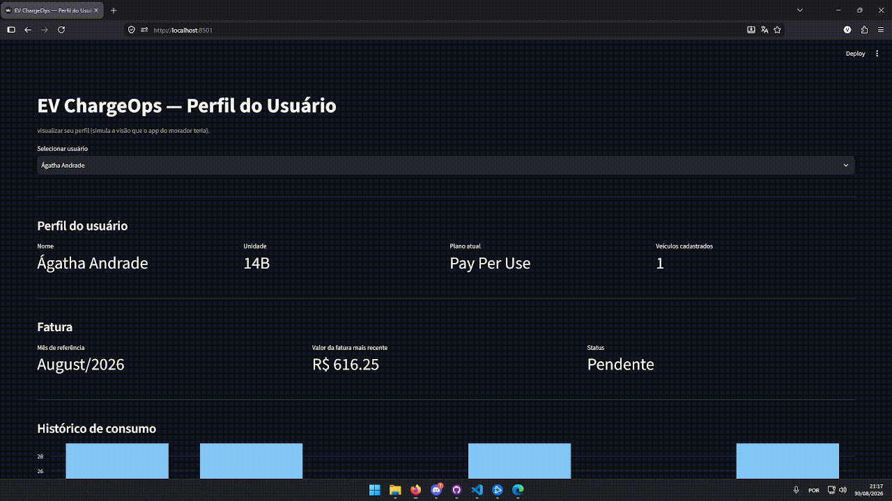
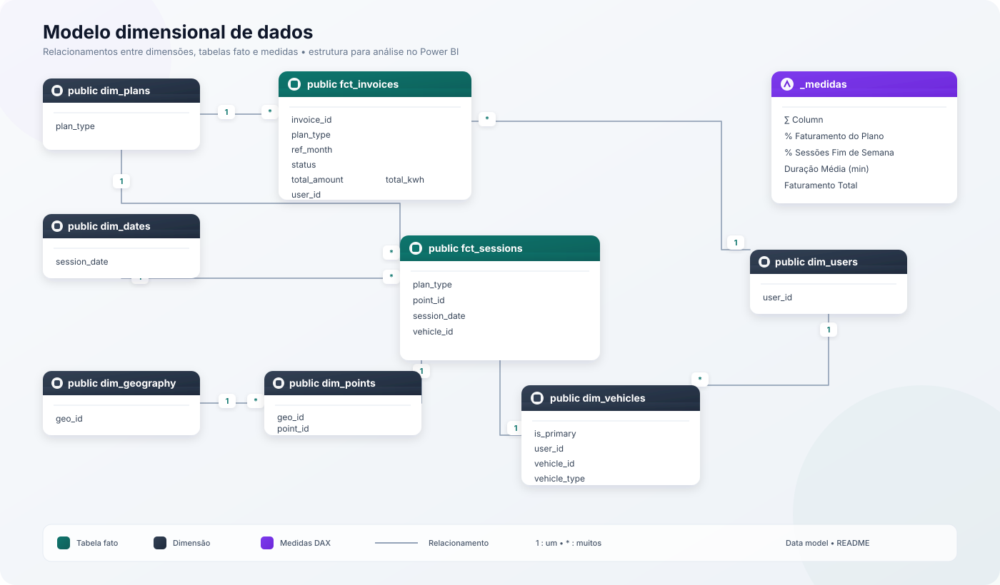

# EV ChargeOps

Enterprise Challenge 2026, parceria GoodWe e FIAP, Equipe 35.

Plataforma de gestão de recarga de veículos elétricos para condomínios e prédios
corporativos: sessões estruturadas por usuário, rateio automatizado, cobrança
transparente e modelos de IA de apoio à operação, tudo validado sobre o carregador
piloto GoodWe HCA G2.

## Equipe

| Nome | RM |
|---|---|
| Arthur Apolonio de Oliveira | rm571385 |
| Matheus Bejarano da Costa Resende | rm569195 |
| Dayvid Daniel Duarte Ramos | rm569482 |
| Bryan Lima Garcia | rm573611 |
| Vinicius Valiati Costa | rm568674 |

## Links do projeto

| Item | Link |
|---|---|
| Painel do gestor (Power BI) | *https://app.powerbi.com/view?r=eyJrIjoiYWQwZTlmOWUtOGM3NC00ZTUxLTg1ZjAtZmRkYzM2NWZkNDE2IiwidCI6IjExZGJiZmUyLTg5YjgtNDU0OS1iZTEwLWNlYzM2NGU1OTU1MSIsImMiOjR9* |
| Dashboard de IA (Streamlit) | *https://vinivaliati-computer-science-fiap-challe-appdashboard-ia-hqsiet.streamlit.app/* |
| App do usuário (Streamlit) | *https://vinivaliati-computer-science-fiap-c-appdashboard-usuario-anjojx.streamlit.app/* |



## Sobre o problema
 
O crescimento da frota elétrica no Brasil chega aos condomínios sem que exista
infraestrutura de gestão para acompanhar. Sem medição individual, o custo da
energia vai para a conta coletiva, dividido entre todos os moradores, mesmo os
que não têm veículo elétrico. Sem coordenação central, o risco de sobrecarga
elétrica aumenta e o acesso para novos moradores fica comprometido.
 
O EV ChargeOps resolve isso transformando cada sessão de recarga em dado
estruturado, alimentando um motor de cobrança automatizado e modelos de IA que
apoiam decisões operacionais e comerciais do gestor.
 
O documento original do desafio, com o levantamento de mercado e a proposta
inicial de arquitetura da Sprint 01, está preservado em
`docs/readme_sprint1.md` como referência histórica. Este README descreve o
que foi de fato construído na Sprint 02, incluindo os pontos em que o plano
original foi revisado a partir do que a implementação real exigiu.
 
## O que este projeto entrega
 
O projeto foi construído em etapas incrementais, cada uma validada com dados
reais antes de avançar para a próxima. Abaixo, o resumo de cada camada.
 
### 1. Fontes de dados externas
 
Três fontes públicas foram exploradas e integradas:
 
* **Open Charge Map**: cobertura de eletropostos públicos no Brasil.
* **IBGE**: hierarquia de municípios e estimativas de população, via API de
  Localidades e API de Agregados (SIDRA).
* **RENAVAM** (Ministério dos Transportes): frota de veículos por UF e
  município, usada para identificar veículos BEV (elétricos puros) e PHEV
  (híbridos plug in) por convenção de sufixo no nome do modelo, já que o
  dataset não traz uma coluna oficial de tipo de combustível.
A fonte originalmente prevista para dados de frota (ABVE) foi descartada
durante a exploração: seus dados são exibidos apenas em painéis de BI
embutidos via iframe, sem HTML tabular, API ou CSV disponível para consumo
programático. O RENAVAM assumiu esse papel por oferecer dado aberto real e
estruturado. O histórico completo dessa decisão e outras descobertas de
formato estão documentados em `docs/fontes-externas.md`.
 
O plano original (Sprint 01) também previa integração com a Google Places
API, para sugerir ao usuário um ponto de recarga alternativo quando o
carregador gerenciado estivesse ocupado. Essa integração não foi
implementada: é um recurso complementar de experiência do usuário, não
central à gestão de cobrança e rateio que é o núcleo do produto, e
depende de uma chave de API paga para uso em volume real. A decisão foi
deixar essa funcionalidade fora do escopo desta sprint.
 
### 2. Dataset simulado
 
Como o carregador físico ainda não gera dados reais durante o desenvolvimento,
foi construído um gerador sintético (`scripts/04_generate_sessions.py`) que
produz seis meses de sessões de recarga para 150 usuários, distribuídos entre
os três planos de cobrança e quatro pontos de recarga.
 
O gerador reproduz de forma controlada os cenários excepcionais que o motor de
rateio precisa tratar: sessões interrompidas, usuários sem uso em algum mês,
unidades com dois veículos cadastrados e sessões com consumo fora do padrão
(anomalias). Cada cenário tem sua proporção documentada no próprio script e
foi validado estatisticamente após a geração, checando físicamente que nenhuma
sessão entrega mais energia do que a potência do ponto permite em relação ao
tempo de carregamento.
 
### 3. Star schema
 
O modelo de dados segue o desenho star schema, com duas tabelas fato e seis
dimensões.
 

 
**Tabelas fato**
 
* `fct_sessoes`: uma linha por sessão de recarga, no grão do veículo.
* `fct_invoices`: uma linha por fatura mensal de cada usuário.
**Tabelas dimensão**
 
* `dim_users`: cadastro de moradores.
* `dim_vehicles`: um veículo por linha, permitindo que uma mesma unidade
  tenha dois veículos com tipos diferentes (BEV ou PHEV).
* `dim_points`: carregadores físicos instalados.
* `dim_plans`: tarifas e regras de cada plano de cobrança.
* `dim_dates`: grão diário, com o primeiro dia do mês (`ref_month`) já
  calculado, usado para agregações mensais sem depender de uma dimensão
  mensal separada.
* `dim_geography`: contexto agregado por município, alimentado pelas três
  fontes externas.
O desenho evoluiu em relação ao rascunho inicial da Sprint 01: `dim_plans` e
`dim_vehicles` foram adicionadas depois que ficou claro que o motor de rateio
precisava de tarifas estruturadas em tabela, não fixas no código, e que o
cenário de dois veículos por unidade exigia uma dimensão própria por veículo,
não um atributo solto em `dim_users`.
 
Uma decisão de modelagem que vale registrar: `fct_invoices.ref_month` não tem
chave estrangeira direta para `dim_dates`, porque `dim_dates` tem grão diário
e a fatura é mensal. A consulta correta para análises por mês agrupa por
`ref_month` em vez de depender de uma relação direta entre as duas tabelas.
 
### 4. Motor de rateio
 
O script `scripts/06_billing_engine.py` calcula a fatura mensal de cada
usuário a partir das sessões registradas, aplicando a fórmula do plano
correspondente:
 
* **Pay per use**: duração total do mês multiplicada pela tarifa por minuto.
* **Assinatura**: taxa fixa mensal somada à duração multiplicada por uma
  tarifa com desconto.
* **Pacote condominial**: custo fixo do condomínio dividido pelo número de
  usuários que efetivamente usaram o serviço naquele mês, somado à duração
  multiplicada pela tarifa reduzida do pacote.
Sessões interrompidas são cobradas normalmente pelo tempo e consumo
registrados até o corte. Faturas que incluem ao menos uma sessão marcada como
anômala recebem status de revisão em vez de pendente, sinalizando a
necessidade de conferência manual antes do envio.
 
### 5. Modelos de inteligência artificial
 
Quatro modelos foram treinados, cada um em um notebook próprio dentro de
`models/`, com validação contra dado real antes de qualquer conclusão.
 
**`01_model_consumption_forecast.ipynb`, previsão de consumo**
Regressão linear que estima o consumo em quilowatt hora e o valor da fatura
do mês seguinte, a partir do padrão de uso do mês atual. O dataset de treino
usa uma janela deslizante entre meses consecutivos, com separação de treino e
teste feita por usuário, não por linha, para evitar que o mesmo usuário
apareça nos dois conjuntos ao mesmo tempo.
 
**`02_model_usage_profiles.ipynb`, perfis de uso**
Agrupamento por K Means que segmenta usuários por frequência de uso, horário
preferencial, consumo médio, duração de sessão e proporção de uso em fim de
semana. O número de grupos foi fixado em quatro por decisão prática de
negócio, já que a diferença estatística entre diferentes quantidades de
grupos testadas era pequena nos dados atuais. O notebook documenta
abertamente essa limitação: no piloto simulado, o horário de uso varia pouco
entre usuários, então a segmentação de fato encontrada reflete
principalmente o consumo médio por sessão.
 
**`03_model_anomaly_detection.ipynb`, detecção de anomalias**
Identifica sessões com consumo, duração ou taxa de carregamento estatisticamente
fora do padrão, usando desvio padrão calculado separadamente para cada ponto de
recarga, já que pontos com potências diferentes não podem ser comparados na
mesma distribuição. Validado contra o rótulo de anomalia conhecido do dataset
simulado, o método capturou a totalidade das anomalias reais, com uma taxa de
falsos positivos aceitável para um processo que já prevê revisão manual.
 
**`04_model_expansion_score.ipynb`, score de expansão**
O documento original da Sprint 01 descrevia este modelo como regressão
logística, um método supervisionado que exige exemplos conhecidos de sucesso
ou fracasso de expansão. Como nenhum município tem ainda um resultado real de
expansão, o modelo foi reformulado como um índice composto, combinando frota
de veículos elétricos, população e cobertura de eletropostos públicos em um
único score de zero a cem por município. Frota e população aumentam o score,
por indicarem mercado potencial. Cobertura de eletropostos públicos reduz o
score, calculada de forma relativa à frota do município, já que o EV
ChargeOps atua em recarga privada e a presença de rede pública reduz a lacuna
que o produto preenche.
 
### 6. Interfaces
 
**Dashboard de IA** (`app/dashboard_ia.py`)
Aplicação Streamlit com uma aba para cada um dos quatro modelos, permitindo
ajustar os parâmetros de entrada de forma interativa e visualizar o resultado
imediatamente. Cada aba inclui uma seção explicando como interpretar os
gráficos e os números apresentados.
 
**App do usuário** (`app/dashboard_usuario.py`)
Protótipo sem autenticação, com um seletor simulando a escolha de um usuário
específico. Mostra o perfil, a fatura mais recente, o histórico de consumo e
a previsão do mês seguinte. A seção de recomendação de plano foi desenhada
sob a ótica do gestor: simula quanto aquele usuário pagaria em cada um dos
três planos, dado seu padrão real de uso, e contextualiza a recomendação com
o cluster de comportamento ao qual ele pertence.
 
Este app lê seus dados de CSVs em `data/processed/`, não de uma conexão
direta ao Postgres. A razão é o ambiente de publicação: hospedado no
Streamlit Community Cloud, o app roda em um servidor que não tem acesso ao
banco local. O script `scripts/09_export_user_app_data.py` exporta os dados
necessários do Postgres para esses CSVs, que ficam versionados no
repositório. Sempre que o conteúdo do banco mudar (novo dataset simulado,
faturas recalculadas), é preciso rodar esse script de novo e commitar os
CSVs atualizados para o app publicado refletir a mudança. O restante do
projeto, painel do gestor, motor de rateio e notebooks, continua consultando
o Postgres normalmente.
 
**Painel do gestor** (Power BI)
Especificado em dois documentos dentro de `docs/`: a estrutura de abas e
visuais (`painel_gestor_especificacao.md`) e as fórmulas de medidas DAX
(`painel_gestor_formulas_dax.md`). O painel tem quatro abas: visão geral,
sessões, faturamento e usuários e pontos.
 
### 7. Testes de integração
 
O script `scripts/08_integration_test.py` roda toda a cadeia principal do
projeto do zero, contra um banco de dados de teste isolado, verificando não
apenas que cada etapa executa sem erro, mas que os resultados numéricos batem
com o esperado: contagem exata de tabelas criadas, integridade referencial
completa entre a tabela de sessões e suas cinco dimensões, e execução bem
sucedida dos três notebooks de IA que não dependem de dados externos. O
script cria e remove seu próprio banco de teste, sem interferir no ambiente
de desenvolvimento.
 
As etapas que dependem de acesso à internet, como a exploração e carga das
três fontes externas, ficam fora deste teste automatizado e devem ser
validadas manualmente quando houver conectividade disponível.
 
## Estrutura do repositório
 
```
ev-chargeops/
├── app/
│   ├── dashboard_ia.py          Dashboard de IA (Streamlit)
│   └── dashboard_usuario.py     App do usuário (Streamlit)
├── data/
│   ├── raw/                     Dados brutos gerados ou baixados, não versionados
│   │   ├── geografia/           Extração completa do RENAVAM usada na carga de dim_geography
│   │   ├── renavam/             Amostra usada na exploração inicial da fonte
│   │   └── simulado/            CSVs gerados por 04_generate_sessions.py
│   └── processed/               Dados tratados
│       └── user_app_*.csv       Exportação para o App do Usuário, versionada (ver seção própria abaixo)
├── docs/
│   ├── app_usuario.gif                    Demonstração do App do Usuário
│   ├── fontes-externas.md                 Descobertas da exploração de APIs
│   ├── painel_gestor_especificacao.md     Estrutura de abas e visuais do BI
│   ├── painel_gestor_formulas_dax.md      Fórmulas DAX do painel
│   ├── readme_sprint1.md                  Documento original do desafio (Sprint 01), mantido como referência histórica
│   └── star_schema.svg                    Diagrama do modelo de dados
├── models/
│   ├── 01_model_consumption_forecast.ipynb
│   ├── 02_model_usage_profiles.ipynb
│   ├── 03_model_anomaly_detection.ipynb
│   ├── 04_model_expansion_score.ipynb
│   └── output/                            Artefatos treinados, gerados ao rodar os notebooks, não versionados
├── scripts/
│   ├── 01_explore_ocm.py               Exploração da API Open Charge Map
│   ├── 02_explore_ibge.py              Exploração da API do IBGE
│   ├── 03_explore_renavam.py           Exploração do dataset RENAVAM
│   ├── 04_generate_sessions.py         Geração do dataset simulado
│   ├── 05_load_star_schema.py          Carga do star schema
│   ├── 06_billing_engine.py            Motor de rateio
│   ├── 07_load_geography.py            Carga de dim_geography
│   ├── 08_integration_test.py          Teste de integração ponta a ponta
│   └── 09_export_user_app_data.py      Exportação de dados para o App do Usuário
├── sql/
│   └── 01_star_schema.sql          DDL completo do banco
├── docker-compose.yml
├── requirements.txt
└── .env.example
```
 
## Como executar
 
### Pré-requisitos
 
Docker e Docker Compose instalados. Python 3.12 ou superior, com um ambiente
virtual próprio recomendado.
 
### Subindo o banco de dados
 
```bash
cp .env.example .env
docker compose up -d
```
 
O Postgres sobe com o schema já criado, a partir de `sql/01_star_schema.sql`.
 
### Instalando as dependências Python
 
```bash
python -m venv .venv
source .venv/bin/activate
pip install -r requirements.txt
```
 
### Populando o banco com dados simulados
 
```bash
export POSTGRES_HOST=localhost
export POSTGRES_PORT=5432
export POSTGRES_DB=evchargeops
export POSTGRES_USER=evchargeops
export POSTGRES_PASSWORD=changeme
 
python scripts/04_generate_sessions.py
python scripts/05_load_star_schema.py
python scripts/06_billing_engine.py
```
 
### Carregando dados geográficos (requer acesso à internet)
 
```bash
export OCM_API_KEY=sua_chave_aqui
python scripts/07_load_geography.py
```
 
### Treinando os modelos de IA
 
Cada notebook em `models/` pode ser executado individualmente pelo Jupyter ou
via linha de comando:
 
```bash
cd models
jupyter nbconvert --to notebook --execute --inplace 01_model_consumption_forecast.ipynb
jupyter nbconvert --to notebook --execute --inplace 02_model_usage_profiles.ipynb
jupyter nbconvert --to notebook --execute --inplace 03_model_anomaly_detection.ipynb
jupyter nbconvert --to notebook --execute --inplace 04_model_expansion_score.ipynb
```
 
### Rodando os dashboards
 
O dashboard de IA lê os artefatos gerados na etapa anterior. O app do
usuário lê CSVs em `data/processed/`, exportados do Postgres:
 
```bash
python scripts/09_export_user_app_data.py
 
streamlit run app/dashboard_ia.py
streamlit run app/dashboard_usuario.py
```
 
Repita o passo de exportação sempre que os dados do banco mudarem, para
manter o app do usuário sincronizado.
 
### Rodando o teste de integração
 
```bash
python scripts/08_integration_test.py
```
 
## Equipe
 
| Nome | RM |
|---|---|
| Arthur Apolonio de Oliveira | rm571385 |
| Matheus Bejarano da Costa Resende | rm569195 |
| Dayvid Daniel Duarte Ramos | rm569482 |
| Bryan Lima Garcia | rm573611 |
| Vinicius Valiati Costa | rm568674 |
 